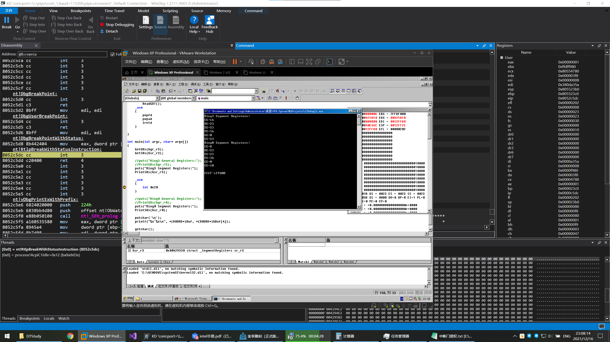

```c
#include "stdafx.h"
#include <Windows.h>
#include <stdio.h>

#ifndef _WIN64
typedef struct _GeneralRegisters
{
    DWORD eax;
    DWORD ecx;
    DWORD edx;
    DWORD ebx;
    DWORD esp;
    DWORD ebp;
    DWORD esi;
    DWORD edi;

}GeneralRegisters, * pGeneralRegisters;
#else
typedef struct _GeneralRegisters
{
    QWORD eax;
    QWORD eax;
    QWORD eax;
    QWORD eax;
    QWORD eax;
    QWORD eax;
    QWORD eax;
    QWORD eax;

}GeneralRegisters, * pGeneralRegisters;
#endif

typedef struct _SegmentRegisters
{
    WORD cs;
    WORD ds;
    WORD es;
    WORD fs;
    WORD gs;
    WORD ss;
    WORD ldtr;
    WORD tr;

}SegmentRegisters, * pSegmentRegisters;


GeneralRegisters gr_r0 = { 0 };
GeneralRegisters gr_r3 = { 0 };

SegmentRegisters sr_r0 = { 0 };
SegmentRegisters sr_r3 = { 0 };

BYTE GDT[6] = { 0 };


void GetGRs(GeneralRegisters* gr)
{
    _asm
    {
        mov ecx, [gr]
        mov dword ptr[ecx + 0x0], eax
        mov dword ptr[ecx + 0x4], ecx
        mov dword ptr[ecx + 0x8], edx
        mov dword ptr[ecx + 0xC], ebx
        mov dword ptr[ecx + 0x10], esp
        mov dword ptr[ecx + 0x14], ebp
        mov dword ptr[ecx + 0x18], esi
        mov dword ptr[ecx + 0x1C], edi
    }
}

void GetSRs(SegmentRegisters* sr)
{
    _asm
    {
        mov ecx,[sr]
        mov word ptr [ecx+0x0], cs
        mov word ptr [ecx+0x2], ds
        mov word ptr [ecx+0x4], es
        mov word ptr [ecx+0x6], fs
        mov word ptr [ecx+0x8], gs
        mov word ptr [ecx+0xA], ss
    }
}

//读取选择子为0008的段描述符
BYTE Buf[0x8] = { 0 };
void __declspec(naked) ReadGDT()
{
    _asm
    {
        //int 3
        pushad
        pushfd

        sgdt GDT
        mov eax, dword ptr[GDT + 0x2]
        mov ebx, dword ptr[eax + 0x8]
        mov dword ptr[Buf], ebx
        mov ebx, dword ptr[eax + 0xC]
        mov dword ptr[Buf+0x4],ebx

        popfd
        popad
        ret
    }
}

void PrintGRs(GeneralRegisters* gr)
{
    printf("EAX=%x\n", gr->eax);
    printf("ECX=%x\n", gr->ecx);
    printf("EDX=%x\n", gr->edx);
    printf("EBX=%x\n", gr->ebx);
    printf("ESP=%x\n", gr->esp);
    printf("EBP=%x\n", gr->ebp);
    printf("ESI=%x\n", gr->esi);
    printf("EDI=%x\n", gr->edi);
}

void PrintSRs(SegmentRegisters* sr)
{
    printf("CS=%x\n", sr->cs);
    printf("DS=%x\n", sr->ds);
    printf("ES=%x\n", sr->es);
    printf("FS=%x\n", sr->fs);
    printf("GS=%x\n", sr->gs);
    printf("SS=%x\n", sr->ss);
}

//中断门调用
void __declspec(naked) INTGate()
{
    _asm
    {
        //int 3	
        //中断门中调用int3，会改变fs寄存器的值，iret/iretd后fs不会恢复，弹异常
        //解决方法：中断调用前push fs保存fs的值，调用结束后再pop fs手动恢复
        //此处引用https://www.cnblogs.com/onetrainee/p/12436327.html看法
        /*
         这个错误的原因并不是Intel的问题，我们之后嵌套调用门，int20 --> int21 并没有发现这个问题；
　　　　　并且查阅intel手册，里面重点强调NT、IF、VM等Eflags位，并没有提到FS寄存器；
　　　　　因此这里可以推断是Windows的处理机制存在的问题，怀疑是先前模式搞得鬼，我们在三环，但是使用
         零环的权限，而系统以为我们在内核调用int3；
　　　　　这问题先放一下，之后如果有时间再来研究这个问题。
        */
        pushad
        pushfd
    }
        GetSRs(&sr_r0);
        ReadGDT();
    _asm
    {
        popfd
        popad
        iretd
    }

}

//陷阱门调用
void __declspec(naked) TrapGate()
{
    _asm
    {
        int 3
        pushad
        pushfd
    }
        GetSRs(&sr_r0);
        GetGRs(&gr_r0);
        ReadGDT();
    _asm
    {
        popfd
        popad
        iretd
    }
}

//中断门和陷阱门唯一的区别就是通过中断门时eflags的IF位被清零以屏蔽可屏蔽中断，而陷阱门不会

int main(int argc, char* argv[])
{
    GetGRs(&gr_r3);
    GetSRs(&sr_r3);

    puts("Ring3 General Registers:");
    PrintGRs(&gr_r3);
    puts("Ring3 Segment Registers:");
    PrintSRs(&sr_r3);

    _asm
    {
        push fs
        int 0x20
        pop fs
    }

    puts("Ring0 General Registers:");
    PrintGRs(&gr_r0);
    puts("Ring0 Segment Registers:");
    PrintSRs(&sr_r0);

    putchar('\n');
    printf("%x`%x\n", *(DWORD*)Buf, *(DWORD*)&Buf[4]);

    getchar();

    return 0;
}
```

