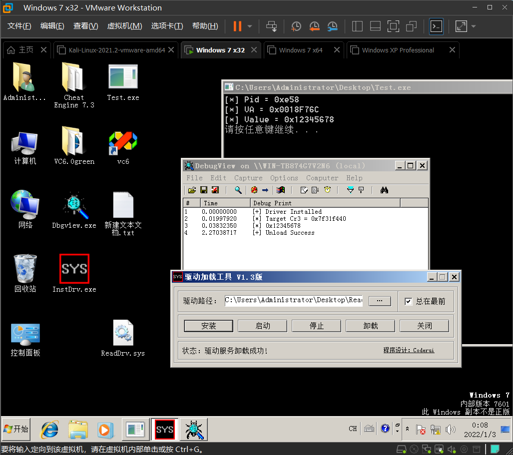

环境：XPx32、Win7x32

项目历时三天，最终在朋友的帮助下，搞成功了！

```c
#include<ntifs.h>
#include <minwindef.h>

#define DEVICE_NAME L"\\Device\\ReadDrv"
#define SYM_LINK_NAME L"\\??\\ReadDrv"

#define _WIN7

NTSTATUS GetProcessDirBase(IN DWORD dwPID, OUT ULONG* pDirBase)
{
    PEPROCESS Process;
    PEPROCESS CurProcess;
    CHAR* pszImageName;
    DWORD dwCurPID;

    __try
    {
        __asm
        {
            //ETHREAD
            mov eax, fs: [124h]
            //Current EPROCESS
#ifdef _XP
            mov eax, [eax + 44h]
#endif
#ifdef _WIN7
            mov eax, [eax + 50h]
#endif

            mov Process, eax
        }

        CurProcess = Process;

        //traversing  EPROCESS
        do
        {
#ifdef _XP
            pszImageName = (char*)CurProcess + 0x174;
#endif
#ifdef _WIN7
            pszImageName = (char*)CurProcess + 0x16C;
#endif
#ifdef _XP
            dwCurPID = (*(ULONG*)((char*)CurProcess + 0x084));
#endif
#ifdef _WIN7
            dwCurPID = (*(ULONG*)((char*)CurProcess + 0x0B4));
#endif
            if (dwCurPID == dwPID)
            {
                *pDirBase = (*(ULONG*)((char*)CurProcess + 0x018));
                return STATUS_SUCCESS;
            }
#ifdef _XP
            CurProcess = (PEPROCESS)((*(ULONG*)((char*)CurProcess + 0x0B8)) - 0xB8);
#endif
#ifdef _WIN7
            CurProcess = (PEPROCESS)((*(ULONG*)((char*)CurProcess + 0x0B8)) - 0xB8);
#endif
            
        } while (CurProcess != Process);
    }
    __except (EXCEPTION_EXECUTE_HANDLER)
    {
        DbgPrint("[-] GetProcessDirBase __except \r\n");
    }

    return STATUS_INVALID_DEVICE_REQUEST;
}

NTSTATUS KeReadProcessMemory(ULONG Pid, ULONG* VirtualAddress, ULONG* pBuffer, ULONG Size)
{
    _asm
    {
        //int 3
    }

    ULONG OldDirBase = 0;
    ULONG DirBase = 0;
    //DWORD dwBufSize = 0x1000;
    BOOL bIsRead = FALSE;
    KIRQL oldIrql = KeRaiseIrqlToDpcLevel();

    NTSTATUS ntStatus = GetProcessDirBase(Pid, &DirBase);
    if (ntStatus < 0)
    {
        DbgPrint("[-] GetProcessDirBase Fail,Status = 0x%x\n", ntStatus);
        return ntStatus;
    }
    DbgPrint("[*] Target Cr3 = 0x%x\n", DirBase);

    __asm
    {
        //Shielding interrupt
        cli
        //close memory protect        
        mov eax, cr0
        and eax, not 10000h
        mov cr0, eax
        mov eax, cr3
        mov OldDirBase, eax
        //swap CR3
        mov eax, DirBase
        mov cr3, eax
    }

    //Alloc ring0 Buff
    //char* szRing0Buf = (char*)MmAllocateNonCachedMemory(Size);
    //check address invalid
    if (MmIsAddressValid(VirtualAddress))
    {
        __try
        {
            RtlCopyMemory(pBuffer, VirtualAddress, Size);
            bIsRead = TRUE;
        }
        __except (1)
        {
            DbgPrint("[-] RtlCopyMemory Fail\n");
        }
    }

    __asm
    {
        mov eax, OldDirBase
        mov cr3, eax
        //Reset  memory protect
        mov eax, cr0
        or eax, 10000h
        mov cr0, eax
        //Restore interrupt
        sti
    }

    KeLowerIrql(oldIrql);

    return ntStatus;
}

NTSTATUS DriverUnload(PDRIVER_OBJECT pDrvObj)
{
    NTSTATUS ntStatus = STATUS_SUCCESS;
    DbgPrint("[+] Unload Success\n");
    return ntStatus;
}


NTSTATUS DriverEntry(PDRIVER_OBJECT pDrvObj, PUNICODE_STRING pRegPath)
{
    NTSTATUS ntStatus = STATUS_SUCCESS;
    //PDEVICE_OBJECT pDeviceObject = NULL;
    UNICODE_STRING uDeviceName = { 0 };
    UNICODE_STRING uSymlinkName = { 0 };
    RtlInitUnicodeString(&uDeviceName, DEVICE_NAME);
    RtlInitUnicodeString(&uSymlinkName, SYM_LINK_NAME);
    DbgPrint("[+] Driver Installed\n");

    VOID* pBuffer = ExAllocatePoolZero(NonPagedPool, 0x1000, 0);
    if (!pBuffer)
    {
        return STATUS_UNSUCCESSFUL;
    }

    KeReadProcessMemory(0xE58, (ULONG*)0x0018F76C,pBuffer,0x1000);
    DbgPrint("[*] 0x%x\n", *(ULONG*)pBuffer);
    //DbgPrint("[*] %ws\n", pBuffer);

    ExFreePool(pBuffer);

    pDrvObj->DriverUnload = DriverUnload;
    return ntStatus;
}
```




[ReadDrv.zip](../_resources/ReadDrv.zip)