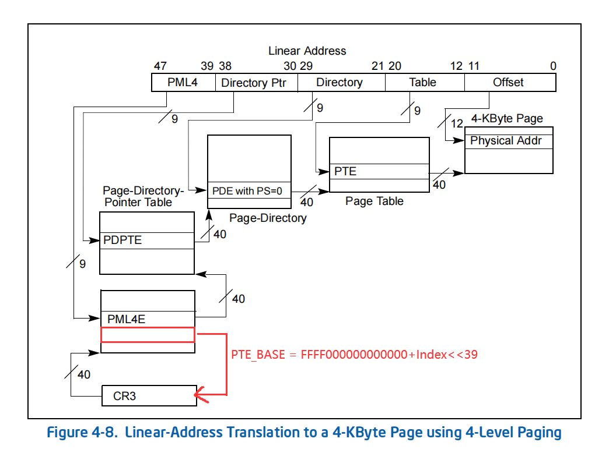

```c
//InitializePteBase(__readcr3());
VOID InitializePteBase(ULONG64 dirbase)
{
    PHYSICAL_ADDRESS phAddr = { 0 };
    ULONG64 slot = 0;
    ULONG_PTR pfn = dirbase >> 12;

    phAddr.QuadPart = pfn << PAGE_SHIFT;

    HARDWARE_PTE* pml4 = (HARDWARE_PTE*)MmGetVirtualForPhysical(phAddr);

    while (pml4[slot].PageFrameNumber != pfn) slot++;

    PTE_BASE = (slot << 39) + 0xFFFF000000000000;
    PDE_BASE = PTE_BASE + (slot << 30);
    PPE_BASE = PDE_BASE + (slot << 21);
    PXE_BASE = PPE_BASE + (slot << 12);

    return;
}
```

