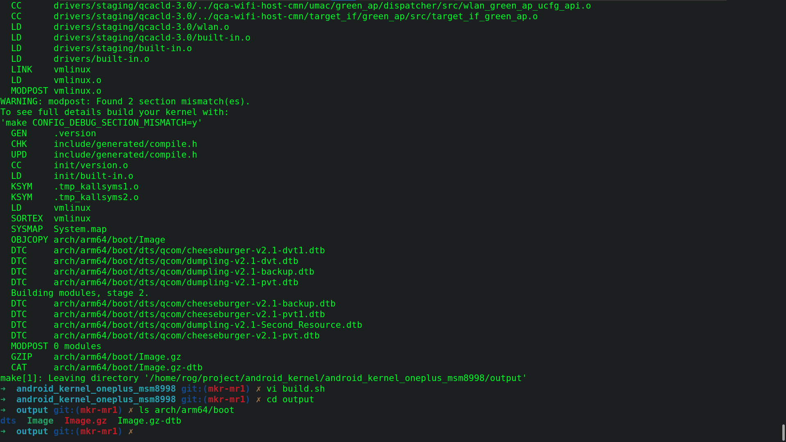
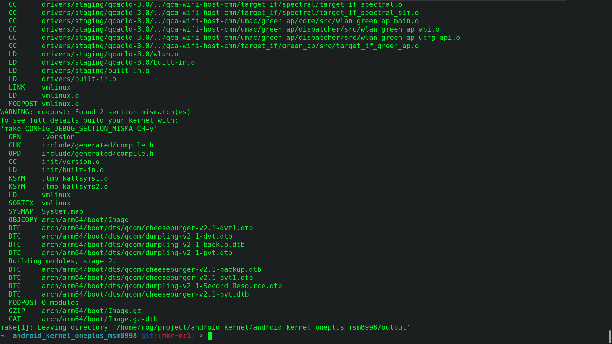
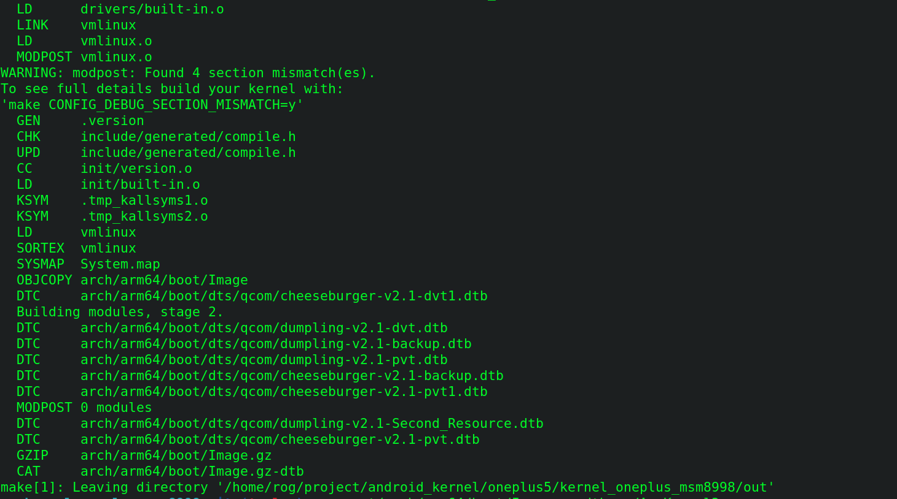

设备：Oneplus 5

内核源码：[https://github.com/MoKee/android\_kernel\_oneplus_msm8998](https://github.com/MoKee/android_kernel_oneplus_msm8998)

编译器：gcc-arm-9.2

编译脚本：

```bash
export ARCH=arm64
export SUBARCH=arm64
export AARCH64=/home/rog/project/android_kernel/toolchain/gcc-arm-9.2-2019.12-x86_64-aarch64-none-linux-gnu/bin
export AARCH32=/home/rog/project/android_kernel/toolchain/gcc-arm-9.2-2019.12-x86_64-arm-none-linux-gnueabihf/bin
export PATH=$ANDROID_AARCH64:$PATH
export CROSS_COMPILE=$AARCH64/aarch64-none-linux-gnu-
export CROSS_COMPILE_ARM32=$AARCH32/arm-none-linux-gnueabihf-

make O=output/ mokee_oneplus5_defconfig
make O=output/ -j$(($(nproc --all)/4))
```

编译过程中将错误视为了警告，故在Makefile中添加-w选项忽略警告

过程中尝试了8个不同版本的内核
换了6个不同版本，不同厂商的gcc编译器

最终编译成功





但是。。。。。。。。。。。。。。。。。。。。。。

。。。。。。。。。。。。。刷入之后无限重启手机变砖

故第二次编译内核

内核源码：[https://github.com/PixelExperience-Devices/kernel\_oneplus\_msm8998](https://github.com/PixelExperience-Devices/kernel_oneplus_msm8998)

编译器：proton-clang https://github.com/kdrag0n/proton-clang

编译脚本：

```bash
#!/bin/bash
args="-j$(($(nproc --all)/4))		#CPU性能的的1/4
O=out \
ARCH=arm64 \
SUBARCH=arm64 \
CLANG_TRIPLE=aarch64-linux-gnu- \
CROSS_COMPILE=${HOME}/project/android_kernel/toolchain/proton-clang/bin/aarch64-linux-gnu- \
CC=${HOME}/project/android_kernel/toolchain/proton-clang/bin/clang \
CROSS_COMPILE_ARM32=${HOME}/project/android_kernel/toolchain/proton-clang/bin/arm-linux-gnueabi-"
make ${args} kernel_defconfig
make ${args}
```

一次成功



直接编译作弊驱动进内核并通过AnyKernel3输入内核Image.gz-dtb


驱动开机成功加载，设备成功创建！！！

总结：第一次变砖是因为并不是Mokee的系统，而第二次系统提前刷成了PixelExperience的，与内核兼容