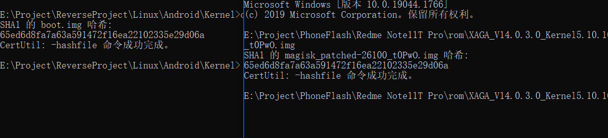

参考文章：https://bbs.kanxue.com/thread-272958.htm
https://github.com/xiaokanghub/Android-Kenerl-boot.img

## 前置

本次逆向的内核为运行在Xiaomi Redmi Note 11T Pro的Miui 14，内核版本为：5.10.101

## 提取boot.img

tip：关于A/B boot分区，咨询了网友，官方默认A分区为主

```shell
# 提取A分区的boot.img
dd if=$(readlink /dev/block/by-name/boot_a) of=/sdcard/boot.img
```

经验证A分区提取出来的boot.img与之前刷入的boot.img相同


## 解包 boot.img

使用magiskboot解包boot.img，github下载一份别人编译好的magiskboot

```shell
./magiskboot unpack boot.img
```

可得到kernel、ramdisk.cpio文件，其中kernel为内核vmlinux镜像，拖到IDA逆就完事了

## 解析内核符号

1.提取内核符号表

```
# 关闭内核指针限制(不关闭只有符号看不见地址)
echo 0 > /proc/sys/kernel/kptr_restrict
# save kallsyms
cat /proc/kallsyms > /sdcard/kallsyms.txt
# 其中 ffffffe054200000 T _text 为内核加载基址
```

2.在IDA中匹配符号

```python
import re
pattern = re.compile('(\w+) (\w) (.+)\n',re.M)
fp = open("C:/kallsyms.txt","r")
while True:
    line = fp.readline()
    if not line:
        break
    matchs = pattern.match(line)
    addr = int(matchs.group(1),16)
    name = matchs.group(3)
    if('$' in name):
        continue
    print(addr,matchs.group(2),name)
    if not idaapi.add_entry(addr,addr,name,0):
        print('Naming failed',hex(addr),matchs.group(2),name)
    if 't' == matchs.group(2) or 'T' == matchs.group(2):
        ida_ua.create_insn(addr)
```

## 重打包boot.img

```shell
./magiskboot repack boot.img
```