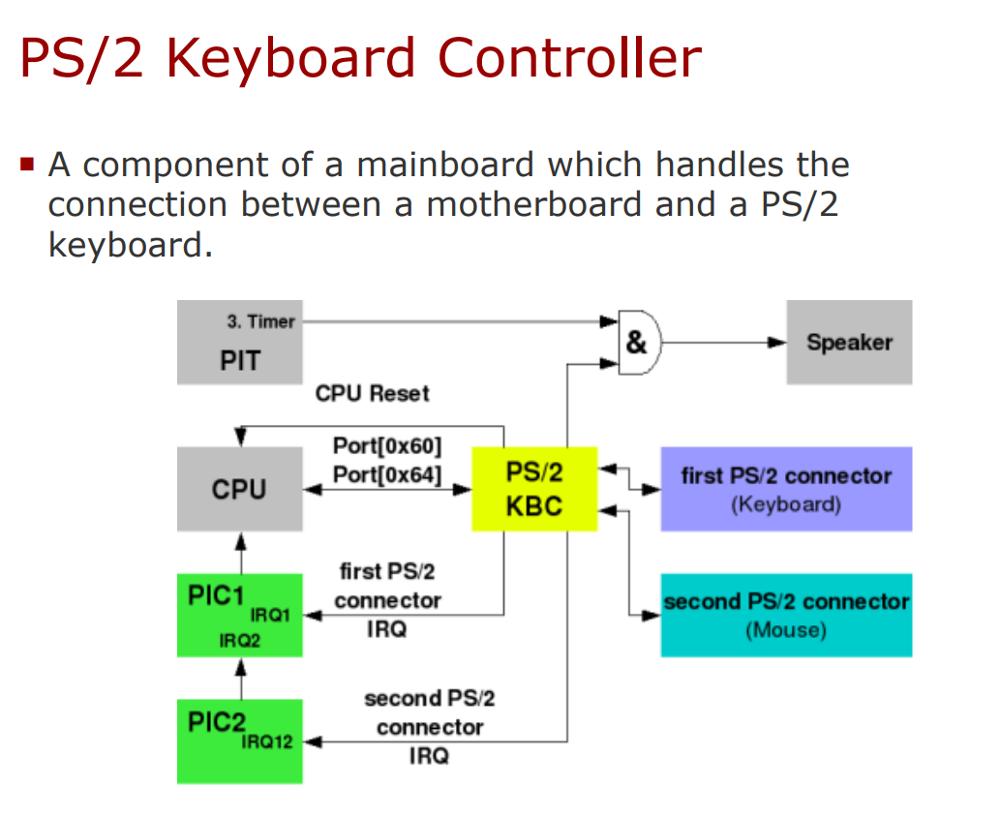
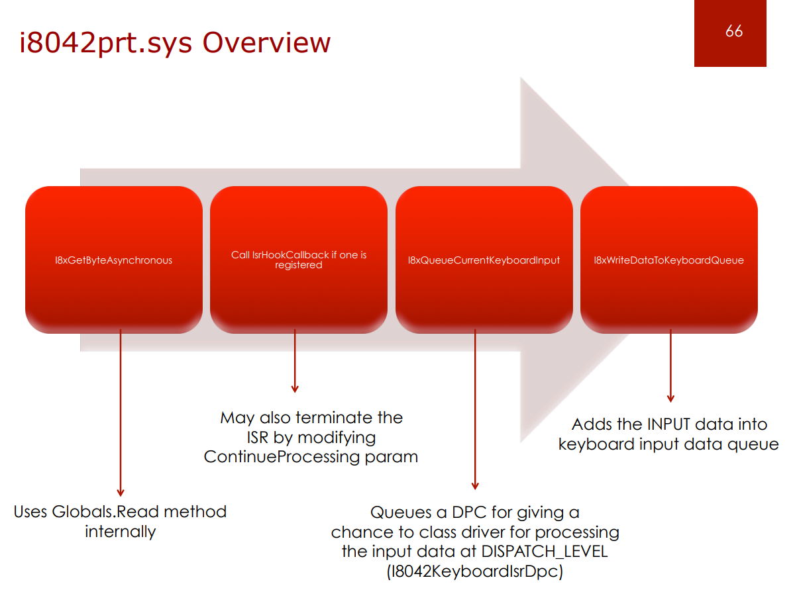
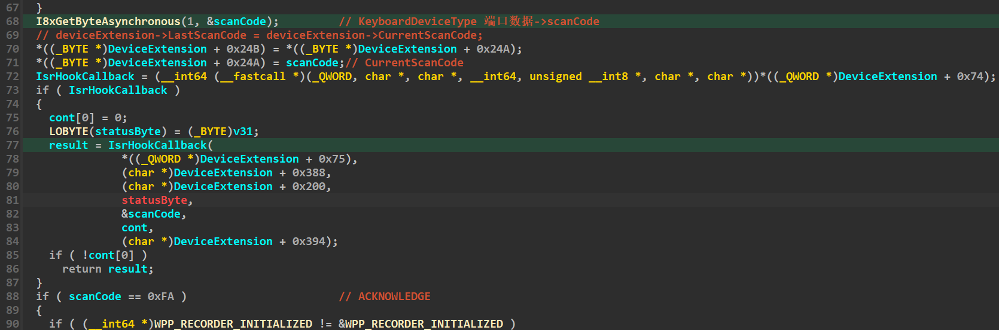
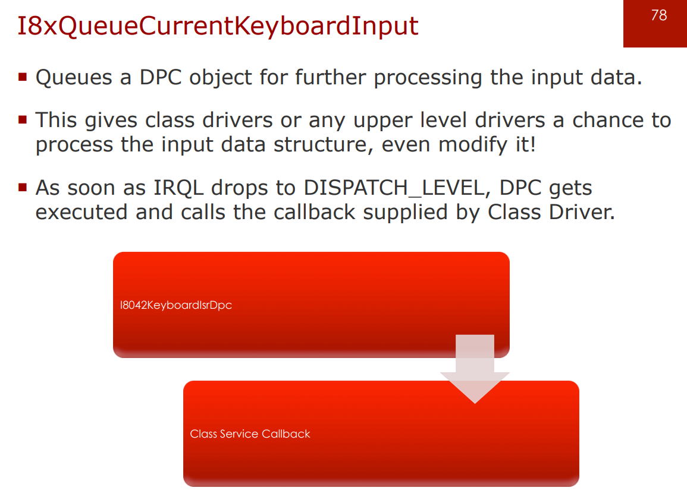
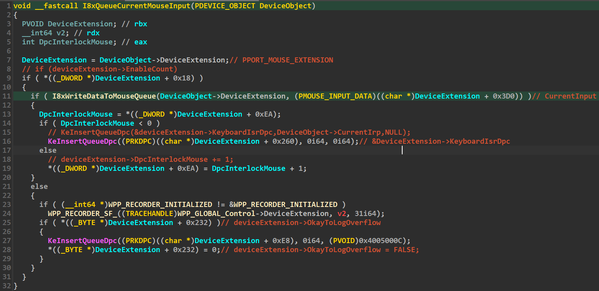
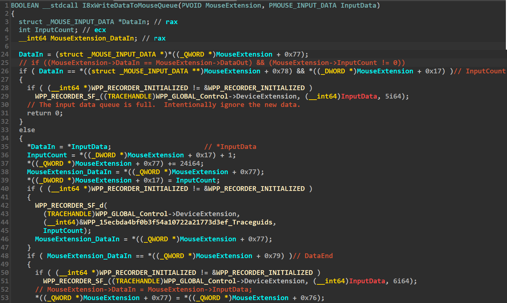

[Windows鼠标键盘(PS2)驱动框架\_ps2标准键盘驱动下载\_叶之香的博客-CSDN博客.pdf](../_resources/Windows鼠标键盘%28PS2%29驱动框架_ps2标准键盘驱动下载_叶之香的博客-CSDN博客-1.pdf)

[\[原创\] 键盘过滤之i8042prt!I8042KeyboardInterruptService深层hoook-软件逆向-看雪-安全社区_安全招聘_kanxue.com.pdf](../_resources/[原创]%20键盘过滤之i8042prt!I8042KeyboardInterruptService深层-1.pdf)

[XP中Inline HOOK 8042驱动实现键盘钩子的方法](https://blog.csdn.net/iiprogram/article/details/2520009)

[键盘驱动系列---JIURL键盘驱动 5](https://blog.csdn.net/cosmoslife/article/details/7853459)

[The Adventures of a Keystroke.pdf](../_resources/The%20Adventures%20of%20a%20Keystroke-1.pdf)

https://learn.microsoft.com/zh-cn/windows-hardware/drivers/hid/keyboard-and-mouse-class-drivers

[https://uefi.org/specs/ACPI/6.5/12\_Embedded\_Controller\_Interface\_Specification.html?highlight=0x64](https://uefi.org/specs/ACPI/6.5/12_Embedded_Controller_Interface_Specification.html?highlight=0x64)

https://blog.csdn.net/hbuxiaofei/article/details/116274989

[ChatGPT勾起了对x86先祖的追忆](https://zhuanlan.zhihu.com/p/608741635)

[Intel8042芯片驱动分析](https://m.it168.com/article_983280.html)

["8042" PS/2 Controller - OSDev Wiki](https://wiki.osdev.org/%228042%22_PS/2_Controller)

[The PS/2 Mouse Interface](https://isdaman.com/alsos/hardware/mouse/ps2interface.htm "The PS/2 Mouse Interface")

https://www.scs.stanford.edu/10wi-cs140/pintos/specs/kbd/scancodes-12.html

[WINIO64位模拟键鼠操作](https://www.cnblogs.com/Loofah/p/4167615.html)

[使用WinIO 模拟鼠标输入](https://blog.csdn.net/qq996980215/article/details/127960448)

https://wiki.osdev.org/PS/2_Mouse

[学习笔记：FPGA之多终端点歌系统设计三：PS/2通信协议](https://blog.csdn.net/Archar_Saber/article/details/82424413)



按键中断 -> 总线 -\> i8259A equivalent PIC -> CPU local APIC
->IDT ISR(I8042KeyboardInterruptService)
->i8042prt!I8xGetByteAsynchronous
->IsrHookCallback
->I8xQueueCurrentKeyboardInput
->I8xWriteDataToKeyboardQueue、KeInsertQueueDpc
->kbdclass/monclass(MouseClassServiceCallback/KeyboardClassServiceCallback)

ISR I8042KeyboardInterruptService中的Hook点：



可以通过DeviceIoControl IOCTL\_INTERNAL\_I8042\_HOOK\_KEYBOARD 设置 deviceExtension->IsrHookCallback



```C
typedef struct _KEYBOARD_INPUT_DATA {
  USHORT UnitId;
  USHORT MakeCode;
  USHORT Flags;
  USHORT Reserved;
  ULONG ExtraInformation;
} KEYBOARD_INPUT_DATA, *PKEYBOARD_INPUT_DATA;

typedef struct _MOUSE_INPUT_DATA {
  USHORT UnitId;
  USHORT Flags;
  __C89_NAMELESS union {
    ULONG Buttons;
    __C89_NAMELESS struct {
      USHORT ButtonFlags;
      USHORT ButtonData;
    } DUMMYSTRUCTNAME;
  } DUMMYUNIONNAME;
  ULONG RawButtons;
  LONG LastX;
  LONG LastY;
  ULONG ExtraInformation;
} MOUSE_INPUT_DATA, *PMOUSE_INPUT_DATA;
```

```C
typedef BOOLEAN
(NTAPI *PI8042_KEYBOARD_ISR)(
  PVOID  IsrContext,
  PKEYBOARD_INPUT_DATA  CurrentInput,
  POUTPUT_PACKET  CurrentOutput,
  UCHAR  StatusByte,
  PUCHAR  Byte,
  PBOOLEAN  ContinueProcessing,
  PKEYBOARD_SCAN_STATE  ScanState);
  
typedef BOOLEAN
(NTAPI *PI8042_MOUSE_ISR)(
  PVOID  IsrContext,
  PMOUSE_INPUT_DATA  CurrentInput,
  POUTPUT_PACKET  CurrentOutput,
  UCHAR  StatusByte,
  PUCHAR  Byte,
  PBOOLEAN  ContinueProcessing,
  PMOUSE_STATE  MouseState,
  PMOUSE_RESET_SUBSTATE  ResetSubState);
```

NtUserGetRawInputData执行流程：

```
1) win32k!InputApc
2) win32k!ProcessKeyboardInput
3) win32k!StartDeviceRead
4) nt!ZwReadFile
5) nt!KiSystemService
6) nt!NtReadFile
7) nt!IopSynchronousServiceTail
8) nt!IopfCallDriver
9) kbdclass!KeyboardClassRead
a) kbdclass!KeyboardClassHandleRead

1) IDT 31h DispatchCode
2) nt!KiInterruptDispatch
3) i8042prt!I8042KeyboardInterruptService
4) i8042prt!I8xGetByteAsynchronous
5) IsrHookCallback
6) i8042prt!I8xQueueCurrentKeyboardInput
7) i8042prt!I8xWriteDataToKeyboardQueue
8) nt!KeInsertQueueDpc

1) hal!HalpDispatchInterrupt
2) hal!HalpDispatchInterrupt2ndEntry
3) nt!KiDispatchInterrupt
4) nt!KiRetireDpcList
5) i8042prt!I8042KeyboardIsrDpc
6) kbdclass!KeyboardClassServiceCallback
7) nt!IofCompleteRequest
8) nt!IopfCompleteReques
9) nt!KeInitializeApc
a) nt!KeInsertQueueApc

1) hal!HalpApcInterrupt
2) hal!HalpApcInterrupt2ndEntry
3) nt!KiDeliverApc
4) nt!IopCompleteRequest
5) nt!KeInitializeApc
6) nt!KeInsertQueueApc

1) nt!KiDeliverApc
2) nt!IopUserCompletion
3) win32k!InputApc

-> StartDeviceRead
-> KeyboardClassHandleRead
-> IRP
-> IopfCompleteReques
-> special APC
-> IopCompleteRequest
-> normal APC
-> InputApc

1) win32k!RawInputThread
2) win32k!CreateKernelEvent
3) win32k!xxxRegisterForDeviceClassNotifications
4) nt!IoRegisterPlugPlayNotification
5) nt!PiNotifyDriverCallback
6) win32k!DeviceClassNotify
7) win32k!CreateDeviceInfo
8) win32k!RequestDeviceChange
9) nt!KeSetEvent

1) win32k!RawInputThread
2) nt!KeWaitForMultipleObjects
3) win32k!ProcessDeviceChanges
4) win32k!StartDeviceRead
```