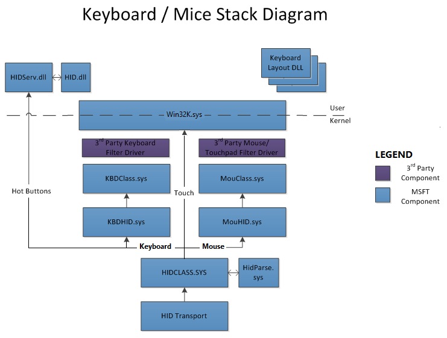
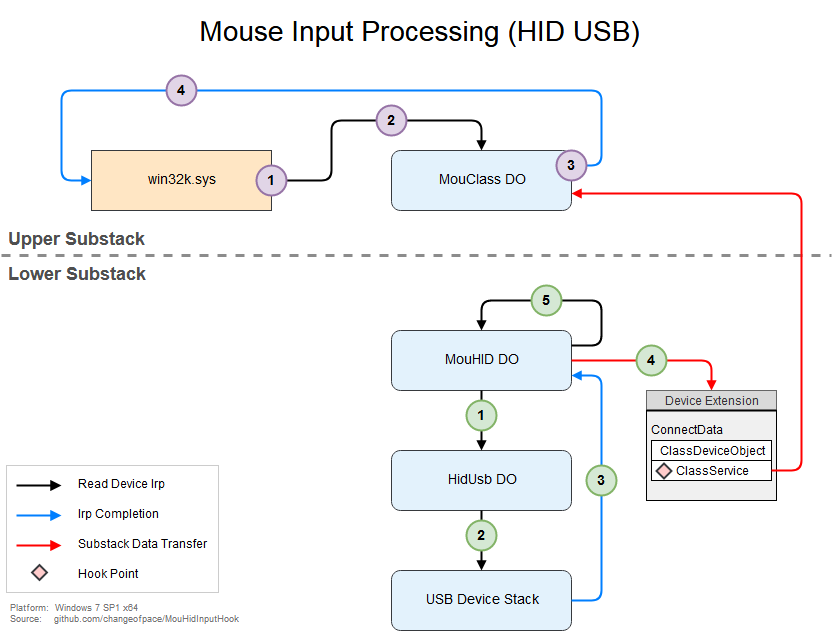

https://learn.microsoft.com/en-us/windows-hardware/drivers/hid/keyboard-and-mouse-hid-client-drivers

https://learn.microsoft.com/en-us/windows-hardware/drivers/hid/hid-transports





```x
00 fffff805`434a2fd8 fffff805`486c3aa8     mouclass!MouseClassServiceCallback
01 fffff805`434a2fe0 fffff805`40824e6e     mouhid!MouHid_ReadComplete+0x758
02 fffff805`434a3080 fffff805`40824d37     nt!IopfCompleteRequest+0x11e
03 fffff805`434a3170 fffff805`4868aef5     nt!IofCompleteRequest+0x17
04 fffff805`434a31a0 fffff805`4868a7ed     HIDCLASS!HidpDistributeInterruptReport+0x3f5
05 fffff805`434a32a0 fffff805`40824e6e     HIDCLASS!HidpInterruptReadComplete+0x37d
06 fffff805`434a3340 fffff805`40824d37     nt!IopfCompleteRequest+0x11e
07 fffff805`434a3430 fffff805`41cc811a     nt!IofCompleteRequest+0x17
08 (Inline Function) --------`--------     Wdf01000!FxIrp::CompleteRequest+0x13 [minkernel\wdf\framework\shared\inc\private\km\FxIrpKm.hpp @ 75] 
09 fffff805`434a3460 fffff805`41cc5bbf     Wdf01000!FxRequest::CompleteInternal+0x23a [minkernel\wdf\framework\shared\core\fxrequest.cpp @ 869] 
0a (Inline Function) --------`--------     Wdf01000!FxRequest::Complete+0x31 [minkernel\wdf\framework\shared\inc\private\common\FxRequest.hpp @ 805] 
0b fffff805`434a34f0 fffff805`4476cb4d     Wdf01000!imp_WdfRequestComplete+0x8f [minkernel\wdf\framework\shared\core\fxrequestapi.cpp @ 436] 
0c fffff805`434a3550 fffff805`4476ca11     USBXHCI!Bulk_Transfer_CompleteCancelable+0xc9
0d fffff805`434a35b0 fffff805`4476c800     USBXHCI!Bulk_ProcessTransferEventWithED1+0x1fd
0e fffff805`434a3660 fffff805`44767101     USBXHCI!Bulk_EP_TransferEventHandler+0x10
0f fffff805`434a3690 fffff805`44766c35     USBXHCI!Endpoint_TransferEventHandler+0xb1
10 fffff805`434a36f0 fffff805`4476690c     USBXHCI!Interrupter_DeferredWorkProcessor+0x315
11 fffff805`434a37f0 fffff805`41cc38f6     USBXHCI!Interrupter_WdfEvtInterruptDpc+0xc
12 (Inline Function) --------`--------     Wdf01000!FxInterrupt::DpcHandler+0x6e [minkernel\wdf\framework\shared\irphandlers\pnp\km\interruptobjectkm.cpp @ 75] 
13 fffff805`434a3820 fffff805`4083989e     Wdf01000!FxInterrupt::_InterruptDpcThunk+0xa6 [minkernel\wdf\framework\shared\irphandlers\pnp\km\interruptobjectkm.cpp @ 410] 
14 fffff805`434a3860 fffff805`40838b84     nt!KiExecuteAllDpcs+0x30e
15 fffff805`434a39d0 fffff805`40a01b3e     nt!KiRetireDpcList+0x1f4
16 fffff805`434a3c60 00000000`00000000     nt!KiIdleLoop+0x9e
```

```
mouhid!MouHid_ReadComplete+0x758:
.text:00000001C0003A80 48 8B 8F E0 00 00 00          mov     rcx, [rdi+0E0h]
.text:00000001C0003A87 4C 8D 87 78 01 00 00          lea     r8, [rdi+178h]
.text:00000001C0003A8E 8A D8                         mov     bl, al
.text:00000001C0003A90 48 8D 97 60 01 00 00          lea     rdx, [rdi+160h]
.text:00000001C0003A97 48 8B 87 E8 00 00 00          mov     rax, [rdi+0E8h]
.text:00000001C0003A9E 4C 8D 4D EC                   lea     r9, [rbp+Consumed]
.text:00000001C0003AA2 FF 15 58 57 00 00             call    cs:__guard_dispatch_icall_fptr  ; call MouseClassServiceCallback
.text:00000001C0003AA2
.text:00000001C0003AA8 8A CB                         mov     cl, bl                          ; NewIrql
.text:00000001C0003AAA 48 FF 15 8F 56 00 00          call    cs:__imp_KeLowerIrql
.text:00000001C0003AAA
.text:00000001C0003AB1 0F 1F 44 00 00                nop     dword ptr [rax+rax+00h]
.text:00000001C0003AB6 33 DB                         xor     ebx, ebx
.text:00000001C0003AB8 38 5D 50                      cmp     [rbp+arg_8], bl
.text:00000001C0003ABB 74 46                         jz      short loc_1C0003B03


HIDCLASS!HidpDistributeInterruptReport+0x3f5:
.text:00000001C000AECC 48 8D 94 24 B0 00 00 00       lea     rdx, [rsp+0F8h+var_48]
.text:00000001C000AED4 48 89 84 24 B0 00 00 00       mov     [rsp+0F8h+var_48], rax
.text:00000001C000AEDC 48 89 50 08                   mov     [rax+8], rdx
.text:00000001C000AEE0 48 81 C1 58 FF FF FF          add     rcx, 0FFFFFFFFFFFFFF58h         ; Irp
.text:00000001C000AEE7 B2 06                         mov     dl, 6                           ; PriorityBoost
.text:00000001C000AEE9 48 FF 15 70 04 02 00          call    cs:__imp_IofCompleteRequest
.text:00000001C000AEE9
.text:00000001C000AEF0 0F 1F 44 00 00                nop     dword ptr [rax+rax+00h]
.text:00000001C000AEF5 EB A9                         jmp     short loc_1C000AEA0


HIDCLASS!HidpInterruptReadComplete+0x37d:
.text:00000001C000A7CA 0F B6 87 01 01 00 00          movzx   eax, byte ptr [rdi+101h]
.text:00000001C000A7D1 49 8B D5                      mov     rdx, r13
.text:00000001C000A7D4 45 0F B7 4C 24 14             movzx   r9d, word ptr [r12+14h]
.text:00000001C000A7DA 48 8B CB                      mov     rcx, rbx
.text:00000001C000A7DD 4D 8B 85 20 01 00 00          mov     r8, [r13+120h]
.text:00000001C000A7E4 88 44 24 20                   mov     byte ptr [rsp+98h+var_78], al
.text:00000001C000A7E8 E8 13 03 00 00                call    HidpDistributeInterruptReport
.text:00000001C000A7E8
.text:00000001C000A7ED
.text:00000001C000A7ED                               loc_1C000A7ED:                          ; CODE XREF: HidpInterruptReadComplete+2B2↑j
.text:00000001C000A7ED                                                                       ; HidpInterruptReadComplete+2BB↑j
.text:00000001C000A7ED 4C 8D 2D 14 C8 01 00          lea     r13, WPP_RECORDER_INITIALIZED
.text:00000001C000A7ED
.text:00000001C000A7F4
.text:00000001C000A7F4                               loc_1C000A7F4:                          ; CODE XREF: HidpInterruptReadComplete+2E8↑j
.text:00000001C000A7F4                                                                       ; HidpInterruptReadComplete+31F↑j
.text:00000001C000A7F4                                                                       ; HidpInterruptReadComplete+43B↓j
.text:00000001C000A7F4                                                                       ; HidpInterruptReadComplete+44D↓j
.text:00000001C000A7F4                                                                       ; HidpInterruptReadComplete+483↓j
.text:00000001C000A7F4 48 63 C6                      movsxd  rax, esi
.text:00000001C000A7F7 2B EE                         sub     ebp, esi
.text:00000001C000A7F9 4C 03 F8                      add     r15, rax
.text:00000001C000A7FC 85 ED                         test    ebp, ebp
.text:00000001C000A7FE 0F 8F 5C FE FF FF             jg      loc_1C000A660


USBXHCI!Bulk_Transfer_CompleteCancelable+0xc9:
.text:00000001C000C1A8 48 8B 15 41 5A 05 00          mov     rdx, cs:WdfFunctions_01023
.text:00000001C000C1AF 8A D8                         mov     bl, al
.text:00000001C000C1B1 44 8B 46 48                   mov     r8d, [rsi+48h]
.text:00000001C000C1B5 48 8B 0D 14 58 05 00          mov     rcx, cs:WdfDriverGlobals
.text:00000001C000C1BC 48 8B 82 38 08 00 00          mov     rax, [rdx+838h]
.text:00000001C000C1C3 48 8B 56 18                   mov     rdx, [rsi+18h]
.text:00000001C000C1C7 FF 15 CB B2 05 00             call    cs:__guard_dispatch_icall_fptr  ; call WdfFunctions_01023[0x107]
.text:00000001C000C1C7
.text:00000001C000C1CD 8A CB                         mov     cl, bl                          ; NewIrql
.text:00000001C000C1CF 48 FF 15 BA AF 05 00          call    cs:__imp_KeLowerIrql
.text:00000001C000C1CF


USBXHCI!Bulk_ProcessTransferEventWithED1+0x1fd:
.text:00000001C000C07F                               loc_1C000C07F:                          ; CODE XREF: Bulk_ProcessTransferEventWithED1+1E1↑j
.text:00000001C000C07F 45 33 C9                      xor     r9d, r9d
.text:00000001C000C082 41 83 C8 FF                   or      r8d, 0FFFFFFFFh
.text:00000001C000C086 48 8B D3                      mov     rdx, rbx
.text:00000001C000C089 48 8B CF                      mov     rcx, rdi
.text:00000001C000C08C E8 73 00 00 00                call    Bulk_Transfer_CompleteCancelable


USBXHCI!Bulk_EP_TransferEventHandler+0x10:
.text:00000001C000BE70                               Bulk_EP_TransferEventHandler proc near  ; DATA XREF: .rdata:00000001C00520A8↓o
.text:00000001C000BE70                                                                       ; .pdata:00000001C00628DC↓o
.text:00000001C000BE70 48 83 EC 28                   sub     rsp, 28h
.text:00000001C000BE74 8B 41 0C                      mov     eax, [rcx+0Ch]
.text:00000001C000BE77 A8 04                         test    al, 4
.text:00000001C000BE79 74 0B                         jz      short loc_1C000BE86
.text:00000001C000BE79
.text:00000001C000BE7B E8 14 00 00 00                call    Bulk_ProcessTransferEventWithED1
.text:00000001C000BE7B
.text:00000001C000BE80
.text:00000001C000BE80                               loc_1C000BE80:                          ; CODE XREF: Bulk_EP_TransferEventHandler+1B↓j
.text:00000001C000BE80 48 83 C4 28                   add     rsp, 28h
.text:00000001C000BE84 C3                            retn


USBXHCI!Endpoint_TransferEventHandler+0xb1:
.text:00000001C00068E0 48 8B 42 20                   mov     rax, [rdx+20h]
.text:00000001C00068E4 48 8B CF                      mov     rcx, rdi
.text:00000001C00068E7 48 8B 40 58                   mov     rax, [rax+58h]
.text:00000001C00068EB FF 15 A7 0B 06 00             call    cs:__guard_dispatch_icall_fptr
.text:00000001C00068EB
.text:00000001C00068F1
.text:00000001C00068F1                               loc_1C00068F1:                          ; CODE XREF: Endpoint_TransferEventHandler+1C693↓j
.text:00000001C00068F1                                                                       ; Endpoint_TransferEventHandler+1C6AB↓j
.text:00000001C00068F1                                                                       ; Endpoint_TransferEventHandler+1C6B6↓j
.text:00000001C00068F1                                                                       ; Endpoint_TransferEventHandler+1C6CD↓j
.text:00000001C00068F1                                                                       ; Endpoint_TransferEventHandler+1C6D8↓j
.text:00000001C00068F1                                                                       ; Endpoint_TransferEventHandler+1C81C↓j
.text:00000001C00068F1                                                                       ; Endpoint_TransferEventHandler+1CBE2↓j
.text:00000001C00068F1 48 8B 74 24 70                mov     rsi, [rsp+58h+arg_10]
.text:00000001C00068F1
.text:00000001C00068F6
.text:00000001C00068F6                               loc_1C00068F6:                          ; CODE XREF: Endpoint_TransferEventHandler+1C647↓j
.text:00000001C00068F6                                                                       ; Endpoint_TransferEventHandler+1C683↓j
.text:00000001C00068F6                                                                       ; DATA XREF: .pdata:00000001C0062414↓o
.text:00000001C00068F6                                                                       ; .pdata:00000001C0062420↓o
.text:00000001C00068F6 48 8B 5C 24 78                mov     rbx, [rsp+58h+arg_18]
.text:00000001C00068FB 48 83 C4 50                   add     rsp, 50h
.text:00000001C00068FF 5F                            pop     rdi
.text:00000001C0006900 C3                            retn


USBXHCI!Interrupter_DeferredWorkProcessor+0x315:
.text:00000001C000641C 48 8D 4D DF                   lea     rcx, [rbp+57h+var_78]
.text:00000001C0006420 E8 1B 04 00 00                call    Endpoint_TransferEventHandler
.text:00000001C0006420
.text:00000001C0006425
.text:00000001C0006425                               loc_1C0006425:                          ; CODE XREF: Interrupter_DeferredWorkProcessor+1C77F↓j
.text:00000001C0006425                                                                       ; Interrupter_DeferredWorkProcessor+1C7DE↓j
.text:00000001C0006425                                                                       ; Interrupter_DeferredWorkProcessor+1C7EB↓j
.text:00000001C0006425                                                                       ; Interrupter_DeferredWorkProcessor+1C846↓j
.text:00000001C0006425 8B 5D DB                      mov     ebx, [rbp+57h+var_7C]


.text:00000001C00060F0                               Interrupter_WdfEvtInterruptDpc proc near
.text:00000001C00060F0                                                                       ; DATA XREF: .pdata:00000001C00623E4↓o
.text:00000001C00060F0                                                                       ; Interrupter_CreateInterrupter+C3↓o
.text:00000001C00060F0 48 83 EC 28                   sub     rsp, 28h
.text:00000001C00060F4 45 33 C0                      xor     r8d, r8d
.text:00000001C00060F7 E8 14 00 00 00                call    Interrupter_DeferredWorkProcessor
.text:00000001C00060F7
.text:00000001C00060FC 48 83 C4 28                   add     rsp, 28h
.text:00000001C0006100 C3                            retn
.text:00000001C0006100
.text:00000001C0006100                               ; ---------------------------------------------------------------------------
.text:00000001C0006101 CC                            db 0CCh
.text:00000001C0006101                               Interrupter_WdfEvtInterruptDpc endp
```